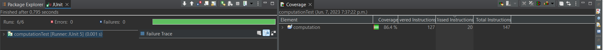
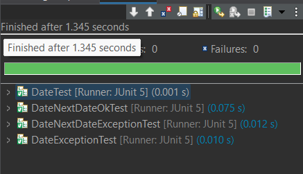
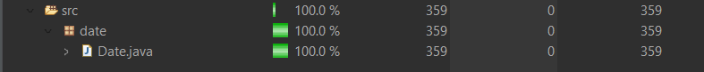
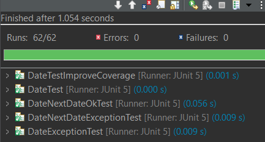
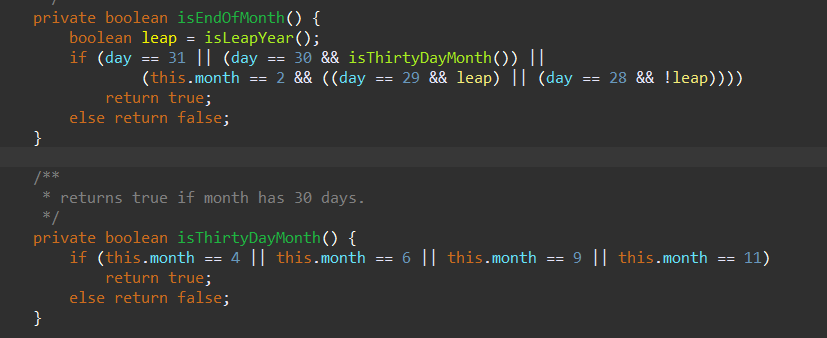
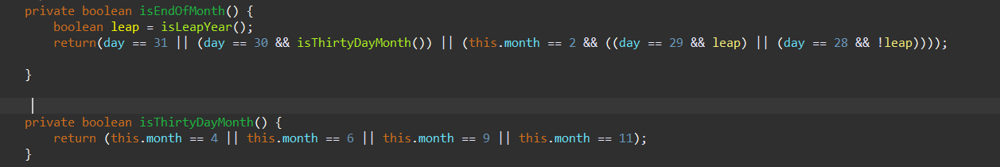

# Avant l'exercise

Exécution de Computation avec Couvrage



Couvrage de Date avant d'ajouter d'autres tests


Run Date avant d'ajouter d'autres tests


# Ajouter Les Tests

Tests Ajouter:

```
import static org.junit.jupiter.api.Assertions.*;

import org.junit.jupiter.api.Test;

class DateTestImproveCoverage {

	@Test
	  void setDay_DayAbove_31() {
	    assertThrows(
	      IllegalArgumentException.class,
	      () -> new Date(2020, 1, 32)
	    );
	  }
	
	@Test
	  void setDay_DayAbove30_IsThirtyDayMonth() {
	    assertThrows(
	      IllegalArgumentException.class,
	      () -> new Date(2020, 4, 31)
	    );
	  }
	
	@Test
	  void setDay_DayAbove29_IsLeapYear() {
	    assertThrows(
	      IllegalArgumentException.class,
	      () -> new Date(2020, 2, 30)
	    );
	  }
	
	@Test
	  void toString_date() {
	    Date date = new Date(3456, 12, 31);
	    assertEquals("3456/December/31", date.toString());
	  }
	
	@Test
	  void equals_string_false() {
	    Date date = new Date(3456, 12, 31);
	    String string = "hello world";
	    assertFalse(date.equals(string));
	  }
	
	@Test
	  void equals_date_true() {
	    Date date1 = new Date(3456, 12, 31);
	    Date date2 = new Date(3456, 12, 31);
	    assertTrue(date1.equals(date2));
	  }
	
	@Test
	  void equals_date_false_differentYear() {
	    Date date1 = new Date(3456, 12, 31);
	    Date date2 = new Date(3455, 11, 15);
	    assertFalse(date1.equals(date2));
	  }
	
	@Test
	  void equals_date_false_differentMonth() {
	    Date date1 = new Date(3456, 12, 31);
	    Date date2 = new Date(3456, 11, 15);
	    assertFalse(date1.equals(date2));
	  }
	
	@Test
	  void equals_date_false_differentDay() {
	    Date date1 = new Date(3456, 12, 31);
	    Date date2 = new Date(3456, 12, 15);
	    assertFalse(date1.equals(date2));
	  }
	
	@Test
	  void isLeapYear_true_notCentury() {
	    Date date = new Date(2020, 12, 31);
	    assertTrue(date.isLeapYear());
	}
	
	@Test
	  void isLeapYear_true_century() {
	    Date date = new Date(2000, 12, 31);
	    assertTrue(date.isLeapYear());
	}
	
	@Test
	  void setMonth_negative1() {
	    assertThrows(
	  	      IllegalArgumentException.class,
	  	      () -> new Date(3456, -1, 31)
	  	    );
	    
	  }
	
	@Test
	  void nextDate_notLeap_28th() {
	    Date today = new Date(2021, 2, 28);
	    Date expectedTomorrow = new Date(2021, 3, 1);
	    assertEquals(expectedTomorrow, today.nextDate());
	  }
	
	@Test
	  void nextDate_30DayMonth_6() {
	    Date today = new Date(2021, 6, 30);
	    Date expectedTomorrow = new Date(2021, 7, 1);
	    assertEquals(expectedTomorrow, today.nextDate());
	  }
	
	@Test
	  void nextDate_30DayMonth_11() {
	    Date today = new Date(2021, 11, 30);
	    Date expectedTomorrow = new Date(2021, 12, 1);
	    assertEquals(expectedTomorrow, today.nextDate());
	  }
	
	@Test
	  void nextDate_30DayMonth_9() {
	    Date today = new Date(2021, 9, 30);
	    Date expectedTomorrow = new Date(2021, 10, 1);
	    assertEquals(expectedTomorrow, today.nextDate());
	  }
	
	@Test
	  void nextDate_Leap_28() {
	    Date today = new Date(2020, 2, 28);
	    Date expectedTomorrow = new Date(2020, 2, 29);
	    assertEquals(expectedTomorrow, today.nextDate());
	  }
	  
}
```

Couvrage de Date après d'ajouter d'autres tests



Run Date après d'ajouter d'autres tests



# Refactoring

Comme Vous pouvex voir le refactoring ne m'a pas aider à achever un couvrage de 100%.
Je l'ai déja achevé sans avoir besoin de faire le refactoring. Le refactoring a seulement servi de nettoyer le code.

Code avant le refactoring



Code après le refactoring



