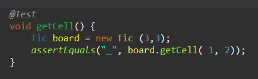
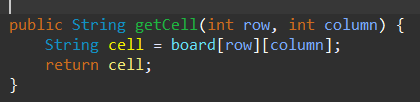

# Lab 4

| Outline  | value|
| ------------- | ------------- |
| Course  | SEG3503  |
| Professor  | Mohamed Ibrahim |
| TA  | Joseph Abonasara |
| Name  | Andre Lepage |
| student number  | 300215137 |

## Commit groups

| Commit name | Commit number| Description |
| ------------- | ------------- | ------------- |
|  get cell test fail / get cell test sucess| 3ff99c6d17e6f50924f5dae0310086e2f880b54e     5a328c89120df8f7ac3a80a6741e1cb06ef11c52   | In this group, we make a test that verifies the ability to check waht the value of a cell is. This would test the getCell method. At first I created the test that verified my desires, ran it, and saw that it failed, then I imlemented the code until the test passed   Test:      Implementation:    |
|   |   |  |
|   |   |  |
|   |   |  |
|   |   |  |