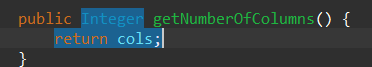
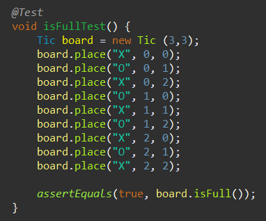

# Lab 4

| Outline  | value|
| ------------- | ------------- |
| Course  | SEG3503  |
| Professor  | Mohamed Ibrahim |
| TA  | Joseph Abonasara |
| Name  | Andre Lepage |
| student number  | 300215137 |

## Commit groups

| Commit name | Commit number| Description |
| ------------- | ------------- | ------------- |
|  get cell test fail / get cell test sucess| 3ff99c6d17e6f50924f5dae0310086e2f880b54e     5a328c89120df8f7ac3a80a6741e1cb06ef11c52   | In this group, I make a test that verifies the ability to check what the value of a cell is. This would test the getCell method. At first I created the test that verified my desires, ran it, and saw that it failed, then I implemented the code until the test passed   Test:        Implementation:    |
|  play test fail / play test sucess| 34faba474d6561ddec0c7038fef92dd98e9cab9c     4757e351bd8ef2730271e641eb8c32f1fd940e0a   | In this group, I make a test that verifies the ability to play a move. This would test the place method. At first I created the test that verified my desires, ran it, and saw that it failed, then I implemented the code until the test passed    Test:       Implementation:    |
| number of rows test fail / number of rows test pass| 7f59ee7668aa39039d0266c75164dff5749bac06     00de81e950538596d6d586b5c62adc74e5b0e416   | In this group, I make a test that verifies the ability to get the number of rows. This would test the getNumberOfRows method. At first I created the test that verified my desires, ran it, and saw that it failed, then I implemented the code until the test passed    Test:       Implementation:    |
| number of cols test fail / number of cols test pass| 29ac3bb9f030f0dc3fad0215248374eb5221f395     65e990391572859cf1e866a353af22f7dca6c67c   | In this group, I make a test that verifies the ability to get the number of columns. This would test the getNumberOfcolumns method. At first I created the test that verified my desires, ran it, and saw that it failed, then I implemented the code until the test passed    Test:       Implementation:    |
| is full test fail / is full test pass| 77c0830f4cc2ffe023657256d0ec785bfcc52f25     4bb9e0c23c6c2b1757313d5fff34a8c793be14fa  | In this group, I make a test that verifies the ability to check if the game is full. This would test the isFull method. At first I created the test that verified my desires, ran it, and saw that it failed, then I implemented the code until the test passed    Test:       Implementation:    |