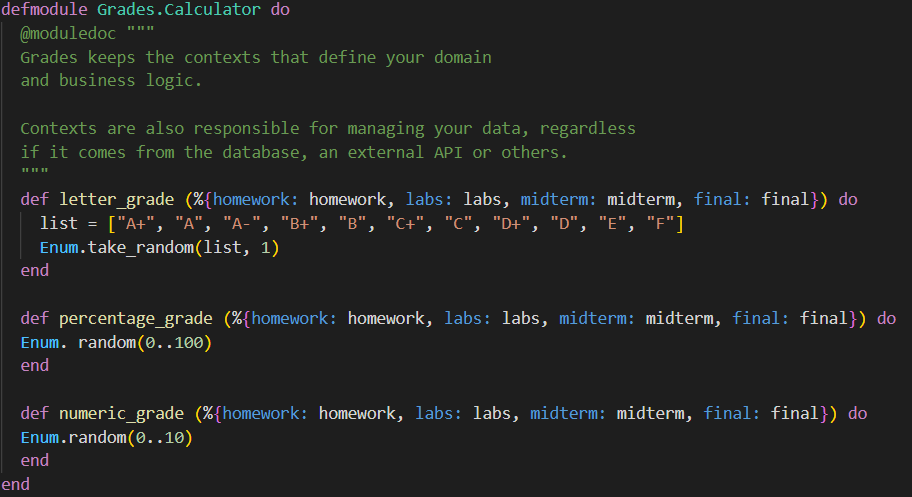
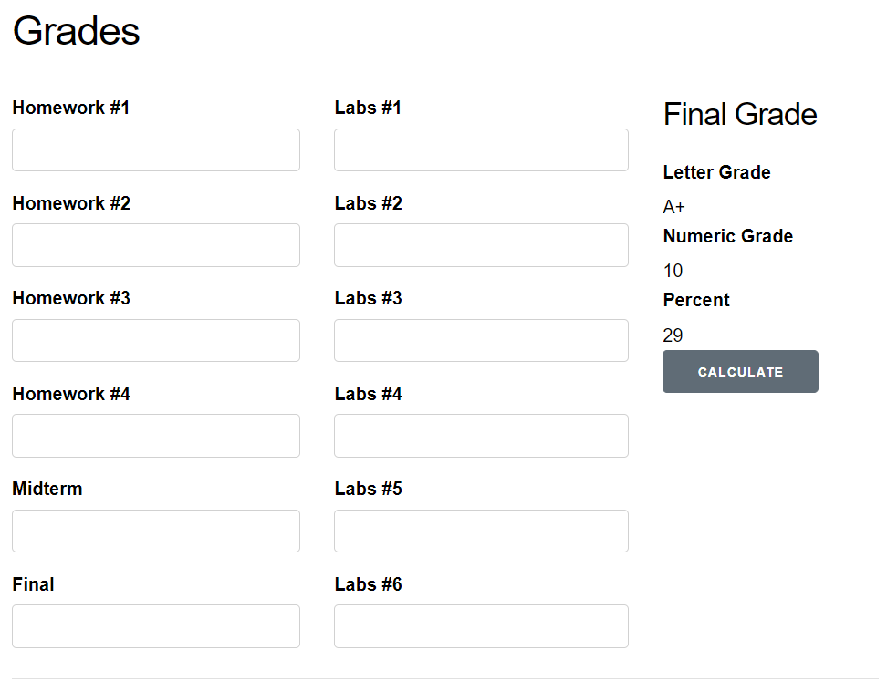
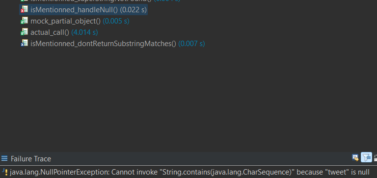
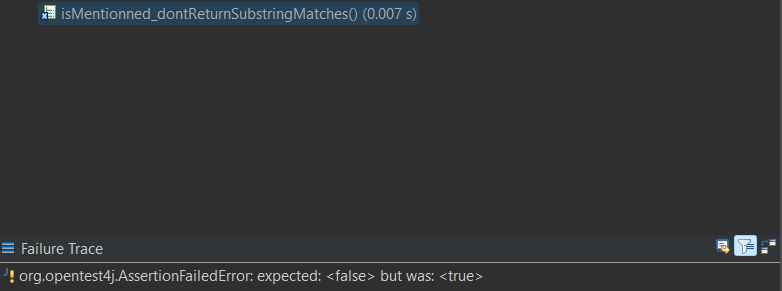
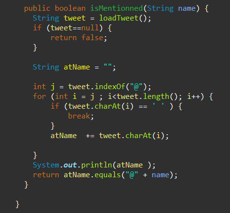
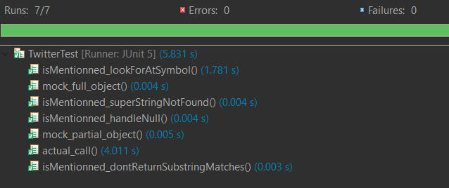

# Lab 5

| Outline  | value|
| ------------- | ------------- |
| Course  | SEG3503  |
| Professor  | Mohamed Ibrahim |
| TA  | Joseph Abonasara |
| Name  | Andre Lepage |
| student number  | 300215137 |

# Grades

## Stubbed Code: <br>



In this part I created Stubs which are a simple implementation of a function or method that returns a fixed output for testing purposes. the Stubs I wrote are meant to Isolate the code that is being tested from that codes dependencies. This will let us see if the different parts of the code are connected well. Once we implement the real code we need to ensure that it matches the behavior of the stubbed code but with the real logic in place.

## Results On the web app with stubbed code: <br>



## Assignment 2 code: <br>

We did not have an assignment 2 with code therefore I am not able to complete this section

# Twitter

## Test Cases:

I implemented the 4 test cases using mocking with easy mock

```
@Test
     void isMentionned_lookForAtSymbol() {
    	 Twitter twitter = partialMockBuilder(Twitter.class)
    	          .addMockedMethod("loadTweet")
    	          .createMock();

    	        expect(twitter.loadTweet()).andReturn("hello @me").times(2);
    	        replay(twitter);

    	        boolean actual;

    	        actual = twitter.isMentionned("me");
    	        assertEquals(true, actual);

    	        actual = twitter.isMentionned("you");
    	        assertEquals(false, actual);
     }

     @Test
     void isMentionned_dontReturnSubstringMatches() {
    	 Twitter twitter = partialMockBuilder(Twitter.class)
   	          .addMockedMethod("loadTweet")
   	          .createMock();

   	        expect(twitter.loadTweet()).andReturn("hello @meat").times(2);
   	        replay(twitter);

   	        boolean actual;

   	        actual = twitter.isMentionned("me");
   	        assertEquals(false, actual);

   	        actual = twitter.isMentionned("meat");
   	        assertEquals(true, actual);
     }

     @Test
     void isMentionned_superStringNotFound() {
    	 Twitter twitter = partialMockBuilder(Twitter.class)
      	          .addMockedMethod("loadTweet")
      	          .createMock();

      	        expect(twitter.loadTweet()).andReturn("hello @me").times(2);
      	        replay(twitter);

      	        boolean actual;

      	        actual = twitter.isMentionned("me");
      	        assertEquals(true, actual);

      	        actual = twitter.isMentionned("meat");
      	        assertEquals(false, actual);
     }
     
     @Test
     void isMentionned_handleNull() {
    	 Twitter twitter = partialMockBuilder(Twitter.class)
      	          .addMockedMethod("loadTweet")
      	          .createMock();

      	        expect(twitter.loadTweet()).andReturn(null).times(2);
      	        replay(twitter);

      	        boolean actual;

      	        actual = twitter.isMentionned("me");
      	        assertEquals(false, actual);

      	        actual = twitter.isMentionned("meat");
      	        assertEquals(false, actual);
     }
```

## Result of tests:

 


when running the tests, I saw that 2 tests failed. These were the isMentioned_handleNull test and the isMentioned_dontReturnSubStringMatches tests.

## Analysis:

I saw that in the isMentionned() method, there is no way to handle a null name. Also, We only check if the name is contained in the tweet meaning substrings will be detected as well. Here is the updated code to handle these cases:



## Result of tests after code update:



After updating the isMentioned() method, All the tests passed.

However, the actual call test can sometimes fail because it is random whether we get a tweet with @me or @you and the expected value is @me.