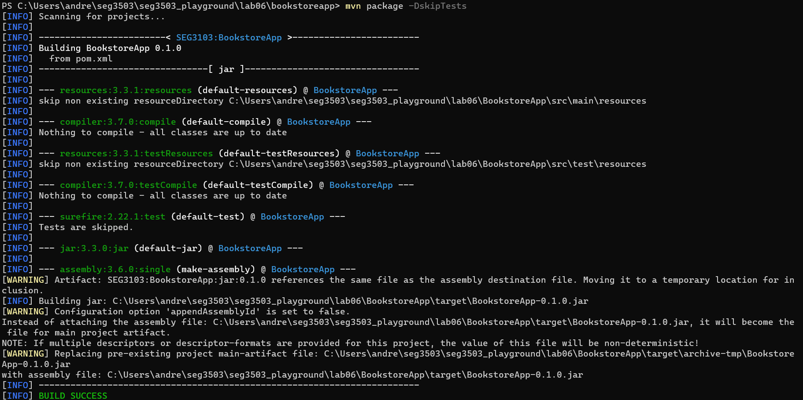

# Lab 6

| Outline  | value|
| ------------- | ------------- |
| Course  | SEG3503  |
| Professor  | Mohamed Ibrahim |
| TA  | Joseph Abonasara |
| Name  | Andre Lepage |
| student number  | 300215137 |

## Steps to run app

### mvn compile <br>


### mvn package -DskipTests <br>


### Running the App with java -jar ./target/BookstoreApp-0.1.0.jar <br>
this command did not work so I had to use java -jar bookstore5.jar and it worked


### login page


### admin page


## Adding test

### mvn-test before adding test


### test added

```

    @Test
    public void additionalTest() {

    driver.get("http://localhost:8080/admin");
    String expectedURL = "http://localhost:8080/login";
    String actualURL = driver.getCurrentUrl();
    assertEquals(expectedURL, actualURL);

    WebElement username = driver.findElement(By.id("loginId"));
    WebElement password = driver.findElement(By.id("loginPasswd"));
    WebElement login = driver.findElement(By.id("loginBtn"));

    username.sendKeys("admin");
    password.sendKeys("password");
    login.click();
    
    expectedURL = "http://localhost:8080/admin";
    actualURL = driver.getCurrentUrl();
    assertEquals(expectedURL, actualURL);

    }

```

This test tests the login fucntionality of the app. When we go to http://localhost:8080/admin we should be redirected to http://localhost:8080/login. Once we login with the proper credentials we should arrive at the http://localhost:8080/admin page wehre we can add books.

### mvn-test after adding  additional test


As we can see by the increased number of passed tests, the test I added passed with sucess and the project built succesfully.